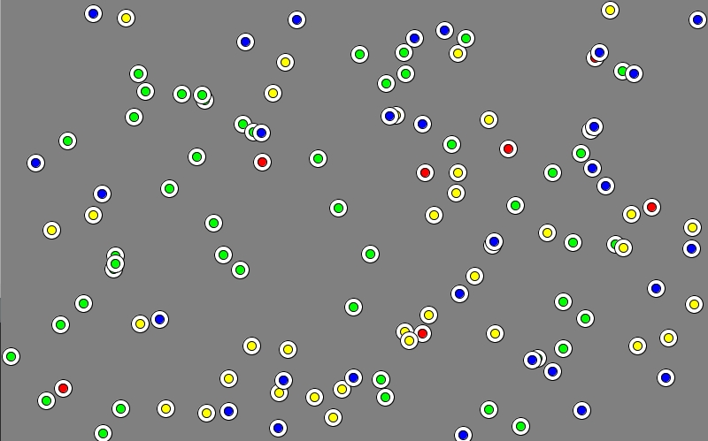
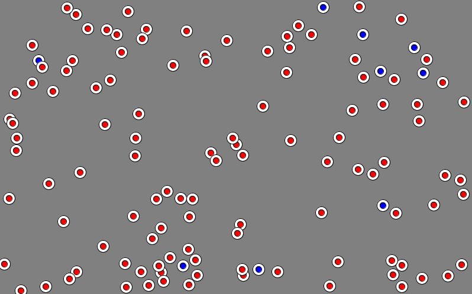
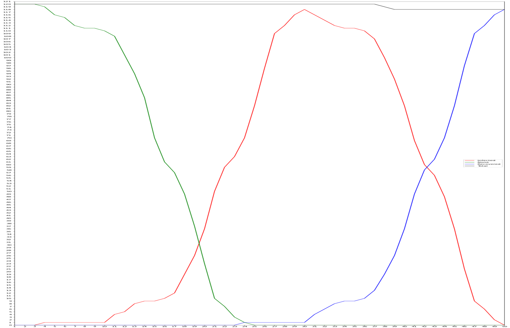
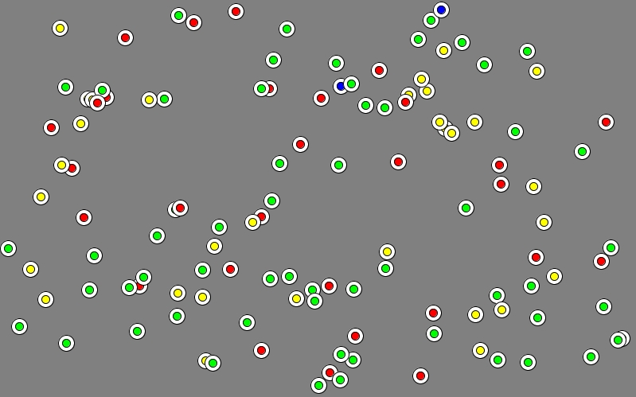
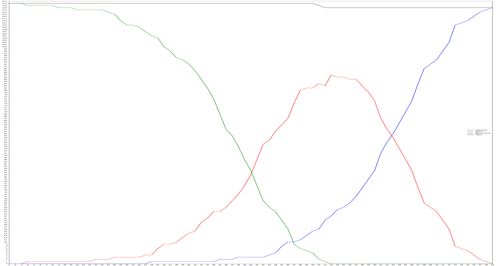
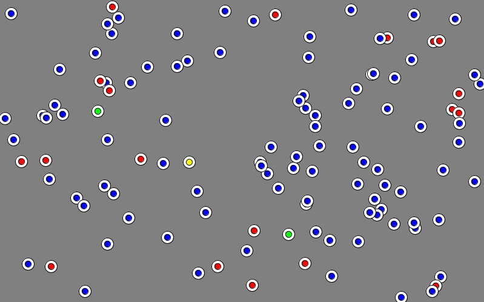
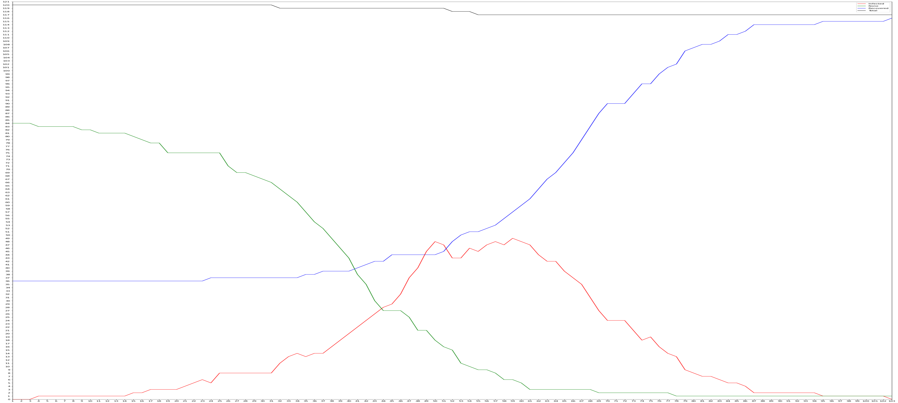
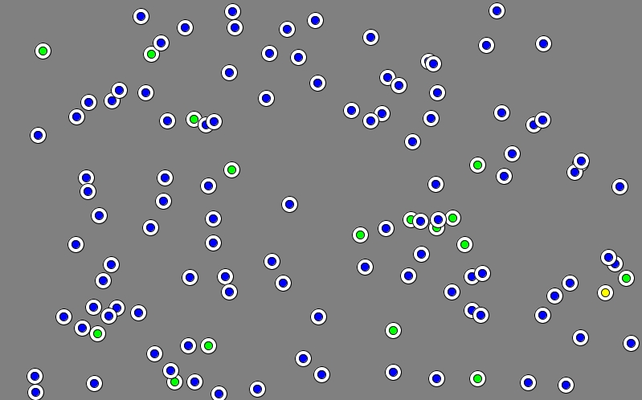
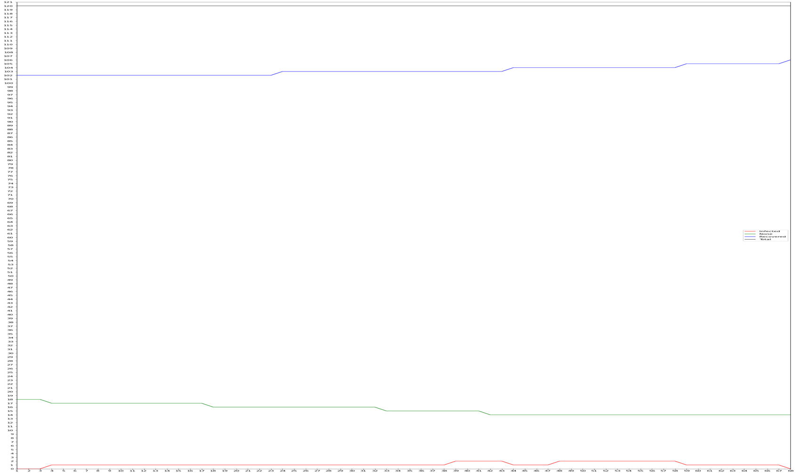

# 코드 설계와 시뮬레이션을 통한 코로나바이러스의 전파와 백신, 집단면역 사이의 관련성에 대한 탐구

> 작성 일자: 2021.06.17

> ⚠️ 이 문서를 읽기 전에 ⚠️
>
> 이 문서는 고등학교 재학 당시 개인 탐구 과제로 작성한 보고서의 내용을 그대로 옮겨 작성한 문서입니다.
>
> 보고서를 작성할 당시에는 탐구 경험과 보고서 작성 경험 모두 많지 않았기 때문에, 내용 중 일부 매끄럽지 못한 부분이나 부족한 부분이 있을 수 있습니다.
>
> 또한, 학교 과제 등을 수행하는 과정에서 이 문서의 내용을 참고하는 것은 괜찮지만, 문서의 내용을 복사해서 그대로 이용하는 등의 행위는 삼가 주시기 바랍니다.
>
> 마지막으로, 탐구를 수행한 이후 컴퓨터를 포맷하면서 시뮬레이션 코드가 유실되어, 코드의 첨부는 어려울 것 같습니다.
>
> **2023.05.29 추가**: 당시 작성한 시뮬레이션 코드의 백업본을 발견했습니다.

## 탐구 동기

코로나바이러스가 전 세계를 강타한 시점에서 백신이 개발되어 추가적인 코로나바이러스의 확산을 막기 위해 전세계의 국가들이 앞다투어 백신 물량 확보 및 접종에 나서고 있다. 현재 미국에서 승인이 되었거나 임상 시험 중인 백신은 그 원리에 따라 크게 3가지로 구분할 수 있는데, 각각 mRNA 백신, 단백질 서브유닛 백신, 바이러스 벡터 백신 등이 있다. 이 백신들은 공통적으로 체내에서 코로나바이러스에 대한 면역력을 갖추도록 하여 백신 접종 후 코로나바이러스가 체내에 다시 침투하더라도 신체가 빠르게 반응하여 질병을 예방할 수 있도록 한다.

만약 어떤 집단의 구성원 중 대부분(70% 이상)이 예방접종을 받아 면역력을 갖춘다면 그 집단 내에서의 전염병의 확산이 저하될 수 있는데, 이를 집단면역이라 한다. 본 탐구에서는 현재 코로나바이러스 백신의 접종률에 따라 코로나가 전파되는 과정을 시뮬레이션을 통해 관찰하고 백신의 접종률이 코로나바이러스의 전파에 어떤 영향을 미치는지에 대해 탐구하였다.

## 이론적 배경

1. 면역

     면역(Immunity)이란 면역 시스템을 갖춘 생물이 감염 또는 질병으로부터 대항하여 병원균을 죽이거나 무력화하는 작용을 말한다. 면역은 그 획득 시기에 따라 선천/후천 면역으로 구분되는데, 선천 면역은 태어날 때부터 갖추고 있는 면역을 의미하고, 후천 면역은 감염 또는 예방접종으로부터 얻는 면역을 말한다.

     면역 반응은 몸속에 침투한 항원(후천 면역 반응을 일으키는 물질)으로부터 시작된다. 만약 병원체(항원)가 코의 점막 등 신체의 물리적 방어막을 뚫고 들어올 경우, 대식세포에 의해 선천 면역 반응이 일어난다. 만약 선천 면역 반응으로 모든 병원체를 처리하지 못했을 경우 수지상세포에 의해 활성화된 T세포에 의해 후천 면역 반응이 일어난다.

     후천 면역 반응에서 T세포는 B세포에 항원에 특이적으로 작용하는 항체의 생성을 명령한다. 이렇게 생성된 항체는 혈액 등 체액을 통해 돌아다니며 항원과 결합하는데, 이는 대식세포와 T세포가 항원을 공격하도록 유도하는 역할을 한다. 이렇게 체내에 침입한 항원을 모두 제거하고 나면, 면역 반응에 관여했던 T세포와 B세포 중 일부는 각각 기억T세포와 기억B세포로 전환되어 그 항원에 대한 정보를 유지한다. 이 세포들은 장기간, 항원에 따라서는 평생 유지되는데 이를 통해 한번 몸속에 침입했던 항원에 대해서는 같은 항원이 침입했을 때 빠르게 반응하여 병원체를 빠르게 없애 질병을 막을 수 있도록 한다.

2. 집단면역

     집단면역(Social immunity)은 특정 감염증에 대한 어떤 집단의 저항력을 말한다. 집단면역은 감염 또는 예방접종을 통해 집단의 상당 부분이 전염병에 대한 예방을 갖췄을 때 얻어진다. 어떤 집단 내에서 집단면역이 이루어졌을 때, 추가적인 전염병의 확산으로부터 비감염자(전염병에 대한 면역이 없는 인원)에 대한 간접적 보호가 가능한 상태이다.

     어떤 집단 내부에서 몇몇 개인은 유전적, 의학적 요인으로 전염병에 대한 면역을 갖출 수 없는 경우가 있다. 집단면역은 이러한 개인들을 질병으로부터 보호하는 중요한 방법이다. 일단 전염병에 대한 면역을 갖춘 인구의 수가 특정한 값에 도달하면, 집단면역은 해당 집단에서 그 전염병을 점차 제거해 나간다. 만약 이러한 집단면역이 전 세계적으로 달성된다면, 해당 전염병의 감염자가 0명이 되어 질병을 박멸할 수 있게 된다. 집단면역을 통해 전염병을 박멸한 사례로는 1977년의 천연두 박멸이 있다.

## 시뮬레이션 탐구

    
    
 [그림 1] 시뮬레이션 진행 중 화면 

 Java 기반의 시각화를 목적으로 하는 프로그래밍 언어인 Processing을 이용해 시뮬레이션 코드를 설계하였다. 시뮬레이션에서 사람의 크기는 지름 20px의 원이고, 가운데 색을 통해 각 사람의 상태를 확인할 수 있도록 제작했다. 사람의 기본 표시 색은 초록색이고, 시뮬레이션 내의 800px $\times$ 500px의 공간 내 랜덤한 위치에서 시작하며, 랜덤한 $x$축 속력과 $y$축 속력을 갖는다. 이때 각 사람의 방향은 벽에 부딪힐 때 반사되는 것처럼 바뀌도록 구현했으며, $x$축 또는 $y$축의 방향이 바뀔 때 그 축의 속력도 같이 랜덤하게 바뀌도록 하여 사람의 이동에 랜덤성을 부여하였다.

 시뮬레이션 상에서 2.4초가 지날 때마다 하루가 지난 것으로 가정하고 설계했으며, 시작 3일 후 감염자 하나가 나타난다. 감염의 구현은 감염자와 비감염자의 거리가 10px 이하일 때 일정 확률로 감염이 전파되도록 구현하였다. 감염자는 빨간색으로 표시되며, 감염자와 접촉하여 감염이 전파될 경우 노란색으로 표시된다. 잠복기는 5일로 설정했으며, 노란색인 사람이 감염 전파된 지 5일이 지날 경우 감염자가 되어 빨간색으로 변한다.

 감염자는 시뮬레이션 상에서 20일이 지나면 완치자가 되어 파란색으로 표시된다. 완치자는 다른 감염자로부터 감염되지 않고, 다른 사람을 감염시킬 수 없다. 감염자는 하루가 지날 때마다 사망할 가능성이 있으며, 코로나 감염으로 인한 사망자 통계를 참고하여 사망률을 3.4%로 설정하고 $(1-x^{20})=0.966$의 방정식을 풀어 나온 값의 근삿값인 0.0017을 감염자의 하루 사망률로 가정하였다. 사망자는 시뮬레이션 화면에 표시되지 않으며, 사망자가 발생할 경우 시뮬레이션 진행 중 콘솔에 총 사람의 수가 1 감소한다.

 만약 시뮬레이션 내 모든 사람(사망자 제외)이 완치자 혹은 비감염자, 즉 파란색 혹은 초록색일 경우 전염병이 종식되었으므로 시뮬레이션을 종료한다.

 시뮬레이션 제작 후, 인터넷을 통해 각종 코로나바이러스에 관련된 통계를 참고하여 시뮬레이션과 관련된 변수들을 설정하였다. 마스크를 착용하지 않았을 경우 감염자가 비감염자에게 감염을 전파할 확률은 16%, 마스크 착용 시 3%로 설정하였다. 또한, 코로나 백신을 맞은 사람의 경우는 완치자와 동일한 설정을 적용하였으며, 비율을 설정하여 현재 시뮬레이션 내 사람 중 얼마나 백신을 맞았는지 설정할 수 있다.

## 시뮬레이션 결과

### 시뮬레이션 1

마스크 미착용, 백신 접종률 0% 가정 → 감염 전파 확률 0.16, 백신 접종률 0으로 설정 후 시뮬레이션 진행

    

        
        
 [그림 2] 시뮬레이션 진행 33일 후 

    

    

        
        
 [그림 3] 색깔별 사람 수 변화 

    

    

결과 : 50일 후 시뮬레이션 내 모든 사람이 완치자가 됨. 120명 시작 후 2명 사망.

### 시뮬레이션 2

마스크 착용, 백신 접종률 0% 가정 → 감염 전파 확률 0.03, 백신 접종률 0으로 설정 후 시뮬레이션 진행

    

        
        
 [그림 4] 시뮬레이션 진행 35일 후 

    

    

        
        
 [그림 5] 색깔별 사람 수 변화 

    

    

결과 : 79일 후 시뮬레이션 내 모든 사람이 완치자가 됨. 120명 시작 후 2명 사망.

### 시뮬레이션 3

마스크 착용, 백신 접종률 30% 가정 → 감염 전파 확률 0.03, 백신 접종률 0.3으로 설정 후 시뮬레이션 진행

    

        
        
 [그림 6] 시뮬레이션 진행 70일 후 

    

    

        
        
 [그림 7] 색깔별 사람 수 변화 

    

    

결과 : 103일 후 시뮬레이션 내 모든 사람이 완치자가 됨. 120명 시작 후 3명 사망.

### 시뮬레이션 4

마스크 착용, 백신 접종률 85% 가정 → 감염 전파 확률 0.03, 백신 접종률 0.85로 설정 후 시뮬레이션 진행

    

        
        
 [그림 8] 시뮬레이션 진행 25일 후 

    

    

        
        
 [그림 9] 색깔별 사람 수 변화 

    

    

결과 : 60일 후 시뮬레이션 내 모든 사람이 완치자가 됨. 120명 시작 후 **0명 사망.**

## 결론

 현실에서 코로나를 비롯해 전염성이 높은 감염병이 발생했을 때 마스크를 착용하는 것과 착용하지 않는 것이 전염병 전파 방지에 얼마나 도움이 되는지 확인하기 위해 시뮬레이션 1, 2를 진행했다. 그 결과 마스크 미착용을 가정한 시뮬레이션 1에서보다 마스크 착용을 가정한 시뮬레이션 2에서의 감염자 증가 속도가 느렸으며, 이는 마스크 착용 및 확진자 발생 시 빠른 격리 및 대응을 비롯한 사회적 대책을 통해 코로나의 확산을 어느 정도 저지할 수 있음을 보여준다.

 또한, 코로나 백신의 접종률과 집단면역 간 관련성을 탐구하기 위해 시뮬레이션 3, 4를 진행하였다. 시뮬레이션 3에서는 백신의 접종률을 30%로 가정했는데, 마스크 착용만을 가정한 시뮬레이션 2에서보다 감염자 증가 속도가 더 느렸지만 30%의 백신 접종률은 집단면역을 불러오지 못했고, 결국 집단 내 모든 사람이 감염되는 결과를 가져왔다. 반면 접종률 85%를 가정한 시뮬레이션 4에서는 집단면역이 발현되어 감염자 수의 증가가 다른 시뮬레이션 상황에 비해 매우 적은 편이었으며, 시뮬레이션 중 유일하게 비감염자가 남아있던 시뮬레이션이었다. 이 시뮬레이션에서는 집단 내 85%가 백신 접종을 통해 면역을 갖추고 있었으므로, 이들이 집단면역을 형성하여 나머지 15%의 인구를 보호했다고 말할 수 있다.

 백신 접종률 30%와 마스크 착용을 가정했던 시뮬레이션 3에서 시뮬레이션 1, 2보다 사망자가 높게 나왔던 이유는 시뮬레이션을 1회만 시행했고, 시뮬레이션을 진행할 때 사람의 수를 120이라는 작은 수치로 설정했기 때문이라 생각한다.

 본 탐구를 통해 시뮬레이션을 이용하여 마스크의 착용과 정부의 빠른 대처가 코로나를 비롯한 전염성 높은 전염병의 확산을 저지할 수 있음을 확인했고, 높은 백신의 접종률이 집단면역을 형성하여 유전적·의학적 이유로 면역을 형성할 수 없는 사람들을 보호할 수 있음과 더 나아가 팬데믹을 종식시키는 데 핵심적인 역할을 할 수 있음을 알아볼 수 있었다.

 추후 탐구로는 이번 탐구에서 제작한 시뮬레이션을 더욱 발전시켜 실내와 실외를 구분하여 감염의 확산을 시뮬레이션하거나, 백신을 맞더라도 그 즉시 항체가 형성되지 않아 전염병에 감염될 수 있는 점 등 여러 현실적인 변수들을 고려하여 시뮬레이션을 제작한 뒤, 이를 바탕으로 발전된 탐구를 진행해 보고 싶다.