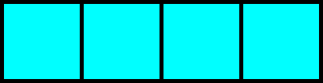
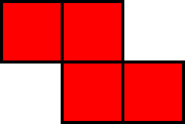

# Tetris

<p align='center'>
    
    <div align='center'> 학습 완료 후 플레이 모습 </div>
</p>

<p align='center'>
    
    <div align='center'> 0.1배속 </div>
</p>

&nbsp;

## 동기
1. 고등학교 2학년 때 우리 학교에는 왠지 모르게 [온라인 테트리스](https://tetr.io/)가 유행하기 시작했는데
2. 정보과 학생들은 자습 시간에 노트북을 들고 모여서 테트리스를 하는 것이 일상이 되었다.
3. 그러던 중 친구 두 명이 테트리스를 하다가 ***정보 선생님***께 걸렸는데
4. 이 친구들은 뭔 생각이었는지 몰라도 **테트리스를 만들기 위해 자료 수집을 하고 있었다**는 변명을 했다.
5. 당연히 이 변명은 씨알도 안 먹혔고
6. 정보 선생님은 이 친구들에게 \"**그렇다면 다음 주까지 온라인 대전을 할 수 있는 테트리스를 만들어와라**\"고 하셨다.
7. 이 친구들은 또 벌점은 받기 싫었는지 주말 동안 열심히 노력해서
8. 기여코 **테트리스를 만들어오는 데 성공**했다!!!
9. 친구들이 만들어온 테트리스를 옆에서 지켜보던 나는 콘솔 창으로 테트리스 모양을 출력하는 모습을 보고
10. 문득 \"**테트리스를 컴퓨터가 플레이하게 만들 좋은 방법이 없을까?**\" 하는 생각이 들었다.
11. 여러 가지 방법을 고민해 본 끝에 **유전 알고리즘**을 활용한 방법이 떠올랐다.
12. *어, 나쁘지 않은데?*
13. 당장 만들어보자!

&nbsp;

## 진행
### 아이디어

<p align='center'>
    
</p>

이 프로젝트의 기반이 되는 아이디어는 다음과 같다.

1. 위 그림과 같은 상황에서는 맨 오른쪽 자리가 `I` 모양 블록을 놓기 ***가장 좋은 자리***일 것이다.
2. 그렇다면, 모든 테트리스 블록을 항상 ***가장 좋은 자리***에 놓는다면 테트리스를 잘하는 것 아닐까?
3. 그럼, ***가장 좋은 자리***의 기준은 무엇일까?
4. ***가장 좋은 자리***를 찾는 방법을 학습시킨다면?

---

### 구조 설계
1. ***가장 좋은 자리***를 계산하는 방법 설계
    * 현재 블록이 쌓인 상태와 블록의 모양이 주어졌을 때, 가능한 모든 위치를 확인해 본다.
    * 블록 모양에 따라 최대 4가지의 회전 상태와 좌우 위치를 모두 고려해 점수를 매기고, 가장 높은 점수를 갖는 위치에 블록을 배치한다.
    * T스핀 등 블록의 회전에 따른 위치까지 고려하면 구조가 복잡해지므로, 블록의 배치는 Hard drop으로 가능한 위치만을 고려한다.
        * Hard drop은 현재 블록이 쌓인 블록이나 바닥에 닿지 않았을 때 스페이스바를 눌러 강제로 낙하시키는 것을 의미한다.
    * 블록을 저장하는 Hold 기능은 고려하지 않는다.

2. 점수를 계산하는 방법 설계
    * 블록 모양에 따라 가능한 모든 위치에 대해, 다음 요소를 고려해 점수를 계산하였다.
        1. 블록을 배치했을 때 지워지는 줄의 수
        2. 블록을 배치했을 때 발생하는 블록 사이 빈 공간, 즉 *구멍*의 칸 수
        3. 블록을 배치했을 때 발생하는 *구멍*의 위를 막고 있는 블록의 칸 수
        4. 블록을 배치했을 때 벽과 인접한 블록의 칸 수
        5. 블록을 배치했을 때 바닥과 인접한 블록의 칸 수
        6. 블록을 배치했을 때 빈 공간 위에 위치하는 블록, 즉 *지붕*의 칸 수
        7. 블록을 배치했을 때 최대 높이
        8. 블록을 배치했을 때 기존 블록과 인접하는 블록의 칸 수
    * 블록을 배치한 후의 상태로부터 위의 요소를 계산한 후, 각 요소별 ***가중치***를 곱해 더한 것이 점수가 된다.
    * 만약 현재 상태에서 최대 높이가 20보다 크다면 게임을 더 진행할 수 없으므로, 점수는 $-\infty$가 된다.
    * 가능한 모든 상태 중 점수가 가장 높은 곳의 위치에 블록을 배치한다.
    * 만약 모든 상태의 점수가 $-\infty$라면, 게임을 종료한다.

3. 유전 알고리즘의 적용 방법 설계
    * **유전 알고리즘**을 통해서는 앞서 언급한 ***가중치***를 최적화하는 방식으로 학습을 진행할 것이다.
    * 각 ***가중치***는 $-100$과 $100$ 사이의 정수로 표현되며, 8가지의 가중치를 묶어 ***유전자***로 표현한다.
    * 처음에는 랜덤한 ***유전자*** 30개를 만들어 1세대를 구성한 후, 다음을 수행한다.
        1. 각각의 ***유전자***를 이용해 테트리스 게임을 실행한다.
        2. 가장 높은 점수를 얻은 ***유전자*** 5개를 선택한다.
        3. 선택한 ***유전자*** 5개의 원소를 임의로 조합해 다음 세대의 ***유전자*** 30개를 만든다.
        4. 각각의 ***유전자***를 변이시킨다.
        5. b.에서 선택한 유전자를 기록한 후, a.로 돌아가 위 과정을 반복한다.

&nbsp;

## 구현
1. 블록 모양

    테트리스에는 다음과 같이 총 7가지의 블록 모양이 존재한다.

    <p align='center'>
        
        
        
        
        
        
        
    </p>

    테트리스에서 블록이 쌓이는 공간의 각 칸을 2차원 배열에 할당하면, 각 블록의 상태는 $4 \times 4$ 배열로 모두 나타낼 수 있다.
    
    그 예시로, `L` 모양 블록의 모습을 나타내면 다음과 같다.
    ```
    block_l = [
        [
            [0, 0, 0, 1],
            [0, 1, 1, 1],
            [0, 0, 0, 0],
            [0, 0, 0, 0]
        ],
        [
            [0, 0, 1, 0],
            [0, 0, 1, 0],
            [0, 0, 1, 1],
            [0, 0, 0, 0]
        ],
        [
            [0, 0, 0, 0],
            [0, 1, 1, 1],
            [0, 1, 0, 0],
            [0, 0, 0, 0]
        ],
        [
            [0, 1, 1, 0],
            [0, 0, 1, 0],
            [0, 0, 1, 0],
            [0, 0, 0, 0]
        ]
    ]
    ```

    이 프로젝트에서는 위와 같은 $4 \times 4$ 배열 안에 모든 블록의 모양과 회전 상태를 나타낸 배열을 정의한 후 구현에 활용했다.

&nbsp;

2. 7-bag Rule
    
    7-bag Rule이란, 테트리스가 *운빨망겜*이 되는 것을 방지하는 규칙이다.

    이 규칙은 테트리스에서 다음에 등장할 블록 모양을 결정하며, 다음과 같이 작동한다.
    1. 테트리스에 등장하는 7가지 블록이 하나씩 들어간 "가방"을 만든다.
    2. 이 가방에서 임의로 꺼낸 블록이 다음 블록이 된다.
    3. 가방이 모두 비었다면, i.로 돌아간다.
    4. 위 과정을 무한히 반복한다.
    
    이 규칙이 적용되면 동일한 블록이 연속으로 세 번 이상 등장할 수 없고, 같은 모양 블록은 최대 13번 안에 다시 확정적으로 등장한다.

    따라서 `I` 모양이 꼭 필요한 상황에서 `I` 모양이 계속해서 등장하지 않아 게임 진행이 꼬이는 등의 상황을 방지할 수 있고, 게임에서 운이 작용하는 영역을 어느 정도 줄일 수 있다.

    이 프로젝트에서는 게임을 실행할 때 앞으로 등장할 블록의 순서를 `list` 자료형으로 관리하고, 이 리스트가 비워질 때마다 7가지 블록이 무작위로 나열된 리스트를 연결하는 방법으로 이 규칙을 구현할 것이다.

&nbsp;

3. 블록 배치

    테트리스에서 블록의 배치 방법은 Soft drop과 Hard drop의 2가지 방법이 있다.
    * Soft drop: 키보드의 `↓` 키를 눌러 블록을 천천히 떨어뜨린다. 떨어지는 중에도 `←`, `→` 키를 이용해 블록이 떨어질 위치를 바꿀 수 있고, `↑` 키를 이용해 회전도 가능하다. 주로 벽에 난 구멍을 채우거나 T스핀 등 고급 기술을 쓰기 위해 사용된다.
    * Hard drop: `Space` 키를 눌러 블록을 한 번에 떨어뜨린다. 블록을 떨어뜨릴 위치가 정해졌을 때 시간을 아끼기 위해 사용된다.

    이 프로젝트에서는 구현의 편의를 위해 Hard drop을 이용한 블록의 배치만을 고려했다.

&nbsp;

## 코드 설계
### 1. 테트리스 기본 규칙

1. **블록 배치**
    
    먼저 테트리스 게임을 진행하며 게임 판에 블록을 떨어뜨리는 기능을 수행하는 `block_drop` 함수를 설계했다.

    ```python
    def block_drop(board, block_type, x): # Make a block be dropped on the board. Needs the x coord to use
        x += X_INDENT
        x -= finding_void(block_type)
        y = 0
        while True:
            if(collision(board, block_type, x, y)): break
            y += 1
        y -= 1
        for p in range(x, x+4):
            for q in range(y, y+4):
                if board[q][p] == 0: board[q][p] = block_type[q-y][p-x]

        return board
    ```
    
    `block_drop` 함수의 매개변수는 다음과 같다.
    * `board`: 블록이 쌓인 상태를 나타내는 게임 판
    * `block_type`: 블록의 형태를 나타내는 $4 \times 4$ 배열 
    * `x`: 블록이 떨어지는 맨 왼쪽 위치 → $x$좌표

    `block_drop` 함수의 반환값은 다음과 같다.
    * `board`: 매개변수의 `board`와 형태가 같은 2차원 배열로, 블록이 쌓인 게임 판 위의 주어진 위치에 주어진 형태의 블록을 떨어뜨린 후의 결과

    `block_drop` 함수를 구현하는 데 사용된 `finding_void` 함수와 `collision` 함수는 각각 다음을 수행한다.
    * `finding_void`: 블록의 상태를 나타낸 배열에서 왼쪽의 빈 열의 수를 반환

        ```python
        def finding_void(block_type): # Returns the length of a block's left side void, making the block dropped from the left side of a board
            for x in range(4):
                for y in range(4):
                    if block_type[y][x]: return x
        ```
    
    * `collision`: 블록의 $x$좌표와 $y$좌표를 받아, 이미 쌓여 있는 블록 또는 바닥과 충돌했는지 여부를 반환

        ```python
        def collision(board, block_type, x, y): # Checks whether a block collides or not
            for i in range(y, y+4):
                for j in range(x, x+4):
                    if board[i][j] != 0 and block_type[i-y][j-x] != 0: return 1
            return 0
        ```

    `block_drop` 함수의 알고리즘은 다음과 같다.
    1. 블록의 맨 왼쪽이 위치할 $x$좌표에서 `finding_void` 함수의 반환값을 빼서 실제 계산에 사용될 인덱스를 계산한다.
    2. $y=0$으로 두고, `collision` 함수의 반환값이 `True`가 될 때까지 $y$의 값을 1씩 증가시킨다.
    3. $p \in [x, x+3]$, $q \in [y, y+3]$인 $p$, $q$에 대해 게임 판 배열과 블록 상태 배열을 순회하며 블록을 배치한다.
    4. 블록이 배치된 게임 판을 반환한다.

&nbsp;

2. **7-bag Rule**

    테트리스에서 적용되는 규칙인 7-bag Rule을 구현하는 `randomblock` 함수를 설계했다.

    ```py
    def randomblock():
        global blocks
        randomlist = []
        for i in range(7):
            r = random.randint(0,6)
            while r in randomlist: r = random.randint(0,6)
            randomlist.append(r)
        blocklist = []
        while(len(randomlist)):
            blocklist.append(blocks[randomlist[0]])
            del randomlist[0]
        return blocklist
    ```

    이 함수의 매개변수는 없으며, 반환값은 테트리스에서 등장하는 7가지 블록이 무작위로 나열된 `list`인 `blocklist`이다.

    `randomblock` 함수의 알고리즘은 다음과 같다.
    1. 빈 리스트 `randomlist`를 선언한다.
    2. `randomlist`에 0부터 6까지의 정수를 무작위 순서로 배치한다.
    3. 또다른 빈 리스트 `blocklist`를 선언한다.
    4. `randomlist`를 앞에서부터 순회하며 `randomlist`의 각 원소에 해당하는 순서의 블록을 `blocklist`에 추가한다.
    5. `blocklist`를 반환한다.

    게임 진행 시 블록이 등장할 순서를 저장한 리스트가 빌 때마다 `randomblock` 함수를 호출해 리스트에 연결하면 게임에 7-bag Rule을 적용할 수 있다.

---

### 2. 최적 위치 계산
1. **현재 블록 모양과 위치에 대한 점수 계산**
    
    첫 번째로 현재 위치에 블록을 배치했을 때의 점수를 계산하는 `evaluation` 함수를 구현했다.

    ```py
    def evaluation(board, priv_board, weight, block_shape): # Evaluates a state of a block by certain factors
        global dfscnt
        score = 0
        LineFill = 0
        Hole = 0
        Holecnt = 0
        BlockHole = 0
        AdhereWall = 0
        AdhereFloor = 0
        Roof = 0
        MaxLevel = 0
        Density = 0

        board, LineFill = removeline(board)

        temp_visit = deepcopy(board_reset)
        dfs(10, 0, board, temp_visit, 1)

        for i in range(24, 0, -1):
            cnt = 0
            for j in range(10, 20):
                if board[i][j]: cnt += 1
                elif not board[i][j] and not temp_visit[i][j]:
                    dfscnt = 0
                    Hole += 1
                    dfs(j, i, board, temp_visit, 2)
                    Holecnt += dfscnt
            if cnt == 10: LineFill += 1
            elif cnt == 0:
                MaxLevel = 24 - i
                break
            
        #PRINT_VISIT(temp_visit)

        for i in range(5, 25):
            AdhereWall += board[i][X_INDENT]
            AdhereWall += board[i][X_INDENT+9]
        for j in range(10,20):
            AdhereFloor += board[24][j]

        temp_visit2 = deepcopy(temp_visit)
        temp_visit = deepcopy(board_reset)

        for i in range(24, 4, -1):
            for j in range(10, 20):
                if not board[i][j] and not temp_visit[i][j] and temp_visit2[i][j] == 2:
                    t = i
                    while not board[t][j] and not temp_visit[t][j] and temp_visit2[t][j] == 2 and t >= MaxLevel:
                        temp_visit[t][j] = 1
                        t -= 1
                    while board[t][j] and not temp_visit[t][j] and t >= MaxLevel:
                        temp_visit[t][j] = 1
                        t -= 1
                        BlockHole += 1

        Density = getdensity(board, priv_board)

        temp_visit = deepcopy(board_reset)

        for i in range(24, 4, -1):
            for j in range(10, 20):
                if not board[i][j] and not temp_visit[i][j] and temp_visit2[i][j] == 1:
                    t = i
                    while not board[t][j] and not temp_visit[t][j] and temp_visit2[t][j] == 1 and t > 0:
                        temp_visit[t][j] = 1
                        t -= 1
                    while board[t][j] and not temp_visit[t][j] and t > 0:
                        temp_visit[t][j] = 1
                        t -= 1
                        Roof += 1


        score += LineFill * weight[LineWeight]

        score += Holecnt * weight[HoleWeight]

        score += BlockHole * weight[BlockHoleWeight]

        score += AdhereWall * weight[AdhereWallWeight]

        score += AdhereFloor * weight[AdhereFloorWeight]

        score += Roof * weight[RoofWeight]

        score += MaxLevel * weight[MaxLevelWeight]

        score += Density * weight[DenseWeight]

        if 0:
            print('L H HC  B AW AF R  M D')
            print('%d %d %2d %2d %2d %2d %d %2d %d' % (LineFill, Hole, Holecnt, BlockHole, AdhereWall, AdhereFloor, Roof, MaxLevel, Density))
            print(score)
            #st = 'L H HC  B AW AF R  M D\n'
            #st += '%d %d %2d %2d %2d %2d %d %2d %d\n%d\n' % (LineFill, Hole, Holecnt, BlockHole, AdhereWall, AdhereFloor, Roof, MaxLevel, Density, score)
            #txt.write(st)
        dfscnt = 0
        if MaxLevel >= 20: return -INF
        return score
    ```

    `evaluation` 함수의 매개변수는 다음과 같다.
    * `board`: 현재 블록을 배치한 후 블록이 쌓인 상태를 나타내는 게임 판
    * `priv_board`: 현재 블록을 배치하기 전 블록이 쌓인 상태를 나타내는 게임 판
    * `weight`: 현재 위치에 블록을 배치했을 때 점수 계산에 사용되는 가중치, 즉 ***유전자***

    `evaluation` 함수의 반환값은 다음과 같다.
    * `score`: 현재 위치에 블록을 배치했을 때 점수

    `block_drop` 함수를 구현하는 데 사용된 함수는 각각 다음을 수행한다.
    * `removeline`: 현재 위치에 블록을 배치했을 때 지워지는 줄의 수와 줄이 지워진 후 게임 판의 상태를 반환

        ```py
        def removeline(board):
            line = 0
            i = 24
            while i>4:
                cnt = 0
                for j in range(10, 20):
                    cnt += board[i][j]
                if cnt == 10:
                    line += 1
                    for j in range(10,20):
                        board[i][j] = 0
                    t = i
                    while t>0:
                        for j in range(10, 20):
                            board[t][j], board[t-1][j] = board[t-1][j], board[t][j]
                        t -= 1
                    i = 25
                i -= 1
            return board, line
        ```
    
    * `deepcopy`: 배열의 깊은 복사를 수행
    
    * `dfs`: DFS 알고리즘을 이용해 게임 판에 존재하는 빈 공간의 수를 계산
    
        ```py
        def dfs(x, y, board, visit, n):
            if x < X_INDENT or x > X_INDENT+9 or y > 24 or y < 0: return
            if visit[y][x] or board[y][x]: return
            global dfscnt
            visit[y][x] = n
            dfscnt += 1
            for i in range(4):
                k = i*2
                p = x + dx[k]
                q = y + dy[k]
                if not visit[q][p] and not board[q][p]:
                    dfs(p, q, board, visit, n)
        ```
    
    * `getdensity`: 현재 위치에 블록을 배치했을 때 기존 블록과 인접하는 블록의 수를 반환

        ```py
        def getdensity(board, priv_board):
            cnt = 0
            for i in range(5, 25):
                for j in range(10, 20):
                    if priv_board[i][j]:
                        for k in range(0, 4):
                            n = k*2
                            p = i + dx[n]
                            q = j + dy[n]
                            if not priv_board[p][q] and board[p][q]: cnt += 1
            return cnt
        ```

    `evaluation` 함수의 알고리즘은 다음과 같다.
    1. `removeline` 함수를 통해 지워지는 줄의 수와 줄이 지워진 후 게임 판의 상태를 구한다.
    2. 현재 게임 판에서 점수를 계산하는 데 필요한 요소를 모두 구한다.
        1. `dfs`를 실행시켜 현재 게임 판에 존재하는 빈 공간 중 *구멍*이 아닌 공간을 모두 표시한다.
        2. 게임 판 전체를 순회하며 위에서 표시되지 않은 빈 공간을 발견하면 `dfs`를 실행한다.
        3. b. 과정이 끝난 후 `dfs` 함수가 실행된 횟수는 *구멍*의 개수, 빈 공간의 수의 총합은 *구멍*의 칸 수가 된다.
        4. b. 에서 발견한 빈 공간에서 위로 움직이며 블록이 위치한 칸 수를 센다.
        5. d. 과정이 끝난 후 센 칸 수의 총합이 *구멍*의 위를 막는 블록의 칸 수가 된다.
        6. 위 과정을 수행하며 블록이 쌓인 곳 중 가장 높은 위치를 찾는다.
        7. `getdensity` 함수를 통해 게임 판에 블록을 배치하기 전과 후의 상태를 비교하여 기존 블록과 인접한 블록 수를 구한다.
        8. 게임 판 전체를 순회하며 빈 공간 위에 배치된 블록, 즉 *지붕*의 수를 구한다.
        9. 게임 판의 바닥과 벽 부분을 순회하며 바닥과 인접한 블록 수, 벽과 인접한 블록 수를 구한다.
    3. 위 과정을 통해 구한 점수 계산 요소에 유전자의 가중치를 곱해 모두 더해서 점수를 계산한다.
        * 만약 현재 게임 판에서 블록이 가장 높이 쌓인 위치의 $y$좌표가 20 이상이라면, 점수는 다른 요소와 관계없이 $-\infty$이다. 
    4. 계산한 점수를 반환한다.

&nbsp;

2. **현재 블록 모양에 대한 최적 위치 계산**

    두 번째 단계로 현재 블록 모양으로부터 최적의 위치를 구하는 `best_location` 함수를 구현했다.

    ```py
    def best_location(board, block_shape, weight): # Finding the best location and shape for a block, by simulating all 40(can be lower) situations
        best_possible = []

        for i in range(len(block_shape)):
            block_type = block_shape[i]
            void_front = finding_void(block_type)
            for x in range(0, 11 - length_block(block_type)):
                next_board = deepcopy(board)
                next_board = block_simulate(next_board, block_type, x)
                score = evaluation(next_board, board, weight, block_shape)
                score_set = [score, i, x]
                best_possible.append(score_set)

        best_possible.sort(key=itemgetter(0), reverse=True)
        return best_possible[0]

    def block_simulate(board, block_type, x):
        board = block_drop(board, block_type, x)
        if 0:
            PPRINT(board)
            #PRINT_F(board)
        return board
    ```

    `best_location` 함수의 매개변수는 다음과 같다.
    * `board`: 현재 블록을 배치한 후 블록이 쌓인 상태를 나타내는 게임 판
    * `block_shape`: 현재 게임 판에 배치해야 하는 블록의 모양
    * `weight`: 현재 위치에 블록을 배치했을 때 점수 계산에 사용되는 가중치, 즉 ***유전자***

    `best_location` 함수의 반환값은 [점수, 블록 모양의 회전 상태, 블록 위치의 $x$좌표]로 구성된 길이 3의 `list`이다.

    `best_location` 함수의 알고리즘은 다음과 같다.
    1. 블록의 가능한 모든 회전 상태에 대해 다음을 수행한다.
        1. 현재 블록의 $x$축 방향 길이를 계산한다.
        2. 0 이상 (10 - 블록의 x축 방향 길이) 이하의 모든 정수에 대해 다음을 수행한다.
            1. 현재 정수를 $t$라 할 때, 현재 게임 판 위에 $x$좌표가 $t$인 지점에 블록을 배치한 후의 상태를 `next_board`에 저장한다.
            2. 현재 게임 판과 블록을 떨어뜨린 후의 게임 판을 `evaluation` 함수에 전달한다.
            3. `evaluation` 함수의 반환값이 현재 상태의 블록을 $x=t$인 위치에 배치했을 때의 점수가 된다.
            4. 현재 점수와 회전 상태, 블록을 배치한 위치의 $x$좌표를 `list`로 묶어 `best_possible` 리스트에 추가한다.
    3. `best_possible` 리스트를 점수를 기준으로 내림차순으로 정렬한다.
    4. `best_possible`의 첫 번째 원소를 반환한다.

    이 함수를 실행하고 `best_possible` 리스트의 정렬이 완료되었을 때, `best_possible`의 첫 번째 원소는 현재 블록 모양과 게임 판 상태로부터 점수를 가장 많이 얻을 수 있는 회전 상태 및 위치가 된다.

    참고로 `best_location` 함수에서 호출되는 `block_simulate` 함수는 블록을 배치한 후의 상태를 디버그하기 위한 함수이며, `best_location` 함수의 알고리즘과는 관계없다.

---

### 3. 게임 실행

1. 게임 실행 및 시각화

    세 번째 단계로는 가중치를 이용해 테트리스 게임을 실제로 수행하고 이를 시각적으로 표현하는 `play_game` 함수를 구현했다.

    ```py
    def play_game(weight, gen, child):
        gen += 1
        child += 1
        global game_board
        line_del = 0
        line_score = 0
        Combo = 0
        game_board = deepcopy(board_reset)
    
        pg.init()
        pg.display.set_caption('Tetris')
        icon = pg.image.load('../etc/1.png')
        pg.display.set_icon(icon)
        screen = pg.display.set_mode([270, 320])
        screen.fill([255, 255, 255])
    
        font = pg.font.SysFont('consolas', 30, True, False)
        font2 = pg.font.SysFont('consolas', 20, True, False)
    
        string1 = font.render("Next:", True, BLACK)
        string2 = font2.render('Gen ', True, BLACK)
        string_gen = font2.render(str(gen), True, BLACK)
        string_child = font.render('%2d' % child + '/' + str(generation_size), True, BLACK)
        string3 = font2.render('Score', True, BLACK)
        string_score = font2.render(str(line_score), True, BLACK)
        string4 = font2.render('Combo', True, BLACK)
        string_combo = font2.render(str(Combo), True, BLACK)
    
        screen.blit(string1, [185, 5])
        screen.blit(string2, [185, 95])
        screen.blit(string_gen, [235, 95])
        screen.blit(string_child, [185, 125])
        screen.blit(string3, [185, 185])
        screen.blit(string_score, [185, 215])
        screen.blit(string4, [185, 245])
        screen.blit(string_combo, [185, 275])
    
        for i in range(1, 22):
            pg.draw.rect(screen, [0, 0, 0], [5, 5+15*(i-1), 12, 12], 0)
            pg.draw.rect(screen, [0, 0, 0], [170, 5+15*(i-1), 12, 12], 0)
    
        for j in range(1, 11):
            pg.draw.rect(screen, [0, 0, 0], [5+15*j, 305, 12, 12], 0)
    
        pg. display.flip()
    
        running = True
        next_blocks = randomblock()
        while running:
            if len(next_blocks) <= 3:
                next_blocks.extend(randomblock())
            next_place = best_location(game_board, next_blocks[0], weight, Combo)
            #print(next_place)
            game_board = block_drop(game_board, next_blocks[0][next_place[1]], next_place[2])
    
            #Screen Clearing
            for i in range(5, 25):
                for j in range(X_INDENT, X_INDENT+10):
                    pg.draw.rect(screen, WHITE,[5+15*(j-9), 5+15*(i-5), 15, 15])
    
            for i in range(0,4):
                for j in range(0,4):
                        pg.draw.rect(screen, WHITE, [185+15*j, 35+15*i, 15, 15], 0)
    
            # Next Block
            for i in range(0,4):
                for j in range(0,4):
                    if next_blocks[1][0][i][j]:
                        pg.draw.rect(screen, BLUE, [185+15*j, 35+15*i, 12, 12], 0)
    
            # Game Board
            for i in range(5, 25):
                for j in range(X_INDENT, X_INDENT+10):
                    if game_board[i][j]:
                        pg.draw.rect(screen, [128, 128, 128], [5+15*(j-9), 5+15*(i-5), 12, 12], 1)
    
            pg.display.flip()
    
            game_board, line_del = removeline(game_board)
            line_score += line_del ** 2
            string_score = font2.render(str(line_score), True, BLACK)
            if line_del: Combo += 1
            else: Combo = 0
            
            # Screen Clearing
            for i in range(5, 25):
                for j in range(X_INDENT, X_INDENT+10):
                    pg.draw.rect(screen, WHITE,[5+15*(j-9), 5+15*(i-5), 15, 15])
    
            pg.draw.rect(screen, WHITE, [185, 215, 100, 30])
    
            for i in range(5, 25):
                for j in range(X_INDENT, X_INDENT+10):
                    if game_board[i][j]:
                        pg.draw.rect(screen, [128, 128, 128], [5+15*(j-9), 5+15*(i-5), 12, 12], 1)
    
            screen.blit(string_score, [185, 215])
    
            string_combo = font2.render(str(Combo), True, BLACK)
    
            pg.draw.rect(screen, WHITE, [185, 275, 100, 30])
    
            screen.blit(string_combo, [185, 275])
    
            pg.display.flip()
    
            if(getmaxlevel(game_board)) <= 5:
                running = False
                print('Gen #%d, Child #%d, Score : %d' % (gen, child, line_score))
                break
            
            for event in pg.event.get():
                if event.type == pg.QUIT:
                    running = False
                    print('Gen #%d, Child #%d (Terminated), Score : %d' % (gen, child, line_score))
                    break
                
            del next_blocks[0]
            #time.sleep(0.01)
        return line_score
    ```

    위 함수는 앞서 ***유전자***의 형태로 나타낸 가중치 리스트를 입력으로 받아 다음을 수행한다.
    * 주어진 ***유전자***를 기반으로 테트리스 게임을 플레이한다.
    * 게임 플레이 과정을 시각적으로 표현한다.
    * 게임이 완료된 후 해당 가중치로 게임을 진행해 얻은 점수를 반환한다.

    게임을 진행하면서 얻는 점수의 계산은 테트리스에서처럼 블록을 배치할 때 지워진 줄의 수에 따라 점수를 얻을 수 있도록 했으며, 한 번에 여러 줄을 지우는 것을 목표로 하도록 점수 계산 공식은 **(블록 배치로 지워진 줄의 수)**${}^2$로 설정했다.

    `play_game` 함수의 구조는 크게 두 부분으로 나눌 수 있는데, `while running:` 으로 시작하는 반복문을 기준으로 해당 반복문의 실행 전과 실행 중으로 구분된다.

    반복문 실행 전 부분에서는 게임 진행 과정을 시각화하는 데 사용되는 Pygame 객체에서 필요한 폰트와 문자열 등을 초기화하는 과정이 이루어진다.

    반복문 실행 중 부분에서는 게임을 플레이하며 변경된 정보를 이용해 화면을 업데이트하는 과정이 이루어진다. 블록을 배치한 후 게임 판의 변화와 점수의 변화, 다음으로 등장할 블록 등의 정보를 화면에 표현하며, 반복문 실행이 1회 완료될 때마다 화면이 한 번 업데이트된다.

    프로젝트에서 구현한 게임 진행 시각화 장면은 아래와 같다.

    <p align='center'>
        
    </p>

    게임 판의 형태는 속이 빈 정사각형으로, 게임 판과 그 외 UI의 구분은 속이 채워진 검은색 정사각형으로 했고, 다음에 등장할 블록의 모양은 화면 오른쪽에 파란색 정사각형으로 나타냈다.

    그 아래에는 유전 알고리즘에서 활용되는 세대 번호와 자식 번호, 유전자를 기반으로 게임을 진행해서 현재까지 얻은 점수와 기타 학습 목적에 맞는 정보를 표시했다.

---

### 4. 유전 알고리즘

1. 변수 설정

    이 프로젝트에서 유전 알고리즘을 적용하기 위해 설정한 규칙은 아래와 같다.

    > * **유전 알고리즘**을 통해서는 앞서 언급한 ***가중치***를 최적화하는 방식으로 학습을 진행할 것이다.
    > * 각 ***가중치***는 $-100$과 $100$ 사이의 정수로 표현되며, 8가지의 가중치를 묶어 ***유전자***로 표현한다.
    > * 처음에는 랜덤한 ***유전자*** 30개를 만들어 1세대를 구성한 후, 다음을 수행한다.
    >     1. 각각의 ***유전자***를 이용해 테트리스 게임을 실행한다.
    >     2. 가장 높은 점수를 얻은 ***유전자*** 5개를 선택한다.
    >     3. 선택한 ***유전자*** 5개의 원소를 임의로 조합해 다음 세대의 ***유전자*** 30개를 만든다.
    >     4. 각각의 ***유전자***를 변이시킨다.
    >     5. b.에서 선택한 유전자를 기록한 후, a.로 돌아가 위 과정을 반복한다.


    위의 규칙을 바탕으로 유전 알고리즘 적용에 필요한 변수를 아래와 같이 설정했다.

    ```py
    generation_size = 30
    next_gen_p = 5
    learning_generation = 100
    weight_num = 9

    mutation_chance = 0.1
    mutation_range = 20
    ```

    위 변수 각각이 의미하는 바는 다음과 같다.

    * `generation_size`: 유전 알고리즘에서 한 세대의 규모, 즉 한 세대가 몇 개의 유전자로 구성될지를 결정한다.
    * `next_gen_p`: 한 세대의 학습이 종료된 후 다음 세대를 구성할 부모 유전자의 개수를 결정한다.
    * `learning_generation`: 몇 개의 세대 동안 학습을 진행할지를 결정한다.
    * `weight_num`: 유전 알고리즘에서 하나의 유전자가 몇 개의 가중치로 구성될지를 결정한다.
    * `mutation_chance`: 부모 유전자로부터 다음 세대가 구성될 때 그 과정에서 변이가 발생할 확률을 결정한다. (0 -> 0%, 1 -> 100%)
    * `mutation_range`: 유전자를 구성하는 과정에서 변이가 발생하는 범위를 결정한다.
    
        * 이 프로젝트에서 하나의 유전자는 $-100$과 $100$ 사이의 정수 8개로 구성되어 있으며, 유전자가 구성될 때 변이가 발생한다는 것은 유전자를 구성하는 정수의 값이 `mutation_range` 이내의 범위에서 변경됨을 의미한다.

&nbsp;

2. 부모 유전자로부터 다음 세대 생성

    다음 함수는 부모 유전자로부터 자식 세대를 생성하는 함수이다.

    ```py
    def make_next_gen(parents):
        next_generation = []
        for k in range(generation_size):
            child = []
            for n in range(weight_num):
                p = random.randint(0, next_gen_p-1)
                child.append(parents[p][n])
            child.append(0)
            next_generation.append(child)
        return next_generation
    ```

    이 함수는 `next_gen_p`의 값에 해당하는 수의 유전자로 구성된 리스트인 `parents`를 입력으로 받아 다음 세대의 유전자로 구성된 리스트인 `next_generation`을 반환한다.

    이 함수가 부모 유전자로부터 다음 세대의 유전자를 구성하는 방법은 다음과 같다.

    1. 0 이상 `next_gen_p` 미만의 정수 $t$를 임의로 선택한다. 
    2. `parents` 리스트에서 $t$번째 유전자를 선택한다.
    3. 선택된 유전자의 가중치가 다음 세대 유전자의 가중치가 된다.
    4. 위 과정을 유전자를 구성하는 가중치의 수만큼 반복한다.

    위의 과정을 한 세대에 포함되는 유전자의 수만큼 반복하면 부모 유전자의 가중치로 구성된 자식 세대가 생성된다.

&nbsp;

3. 유전자 변이

    다음 함수는 부모 세대로부터 생성된 유전자에 변이를 일으키는 함수이다.

    ```py
    def mutate(child):
        for i in range(weight_num):
            chance = random.random()
            if chance < mutation_chance:
                child[i] += random.randint(-mutation_range, mutation_range)
            if i == LineWeight or i == AdhereWallWeight or i == AdhereFloorWeight or i == DenseWeight or i == ComboWeight:
                child[i] = abs(child[i])
            else: child[i] = -abs(child[i])
        child[weight_num] = 0
        return child
    ```

    이 함수는 하나의 유전자를 입력으로 받아 해당 유전자를 변이시킨 후 반환한다. 이때 그 과정은 아래와 같다.

    1. 유전자에 포함되는 모든 가중치에 대해 다음을 수행한다.
        1. 0 이상 1 미만의 난수를 하나 선택한다.
        2. 선택된 난수가 `mutation_chance`보다 작다면 현재 가중치에 절댓값이 `mutation_range`보다 작은 임의의 정수를 더한다.
    2. 변이된 유전자를 반환한다.

    이 프로젝트에서는 유전 알고리즘의 속도를 향상시키기 위해 위의 변이 과정을 약간 변형하여, 아래와 같이 설계했다.
    
    * 점수 계산에 사용되는 가중치 중 게임 진행에 긍정적인 요인과 부정적인 요인을 구분한 후, 유전자 변이 시 긍정적인 요인은 항상 양의 값을 갖도록, 부정적인 요인은 항상 음수가 되도록 한다.

    위와 같은 휴리스틱 방법을 적용하면 구성되는 유전자의 다양성은 떨어질 수 있지만, 경험적으로 불필요한 유전자가 생성되는 것을 막아 학습에 필요한 시간을 줄일 수 있다.

&nbsp;

## 학습 진행

다음 코드는 지금까지 설계한 함수를 종합해서 유전 알고리즘을 적용한 테트리스 게임 학습을 진행하는 코드이다.

```py
for gen in range(learning_generation):
    play_score = []
    next_gen = []

    for child in range(generation_size):    # Loop 1
        generation[child][weight_num] = play_game(generation[child], gen, child)
        play_score.append(generation[child])

    play_score.sort(key=itemgetter(weight_num), reverse=True)

    txt = open('./Weights.txt', 'a')
    pprint(play_score[0])
    for nxt in range(0,5):                  # Loop 2
        st = ''
        for i in play_score[nxt]:
            st += '%7d,' % i
        txt.write('[ ' + st + ' ] #' + str(gen+1) + '\n')
    txt.write('- - - - - - - - - - - - - - - - - - - - - - - - - #' + str(gen+1) + '\n\n')

    for child in range(next_gen_p):         # Loop 3
        next_gen.append(play_score[child])
    txt.close()

    generation = make_next_gen(next_gen)

    for child in generation:                # Loop 4
        mutate(child)
```

위 코드의 반복문은 학습을 진행할 세대 수를 나타내는 변수인 `learning_generation`의 값만큼 실행되며, 내부의 반복문은 각각 다음과 같은 기능을 수행한다.

* `Loop 1`: 각 세대에 포함된 유전자 각각을 기반으로 테트리스 게임을 플레이한 후 그 결과를 `play_score` 리스트에 저장한다. 이후 `play_score`는 얻은 점수를 기준으로 내림차순 정렬된다.

* `Loop 2`: 정렬이 완료된 `play_score` 리스트에서 다음 세대를 구성하는 데 사용될 상위 유전자, 즉 부모 유전자를 파일에 기록한다.

* `Loop 3`: 다음 세대를 구성하는 데 사용될 부모 유전자를 `next_gen` 리스트에 추가한다. 이후 `next_gen`에 저장된 유전자와 `make_next_gen` 함수를 통해 다음 세대를 생성한 후 `generation` 리스트에 저장한다.

* `Loop 4`: `generation`에 저장된 다음 세대 유전자에 대한 변이를 수행한다.

지금부터의 내용은 위 코드를 실행하여 학습을 진행하는 과정을 기록한 것이다.

---

1. 첫 번째 학습

    먼저 위의 코드를 완성한 직후 프로그램을 실행해 학습을 진행했다.

    첫 번째 세대의 유전자는 임의의 난수로 구성되어 있는데, 이를 바탕으로 게임을 플레이한 모습은 아래와 같았다.

    <p align='center'>
        
    </p>

    이러한 모습은 우리가 일반적으로 생각하는 테트리스에서 블록을 배치하기 적합한 자리가 아닌, 난수 가중치를 바탕으로 계산된 점수가 가장 높은 자리에 블록을 배치하기 때문에 나타나는 현상이다.

    다음은 첫 번째 학습을 진행한 후 각 세대별 부모 유전자들을 기록한 파일의 내용이다.

    ```
        L    H    B    M    R    AW   AF    D    Score
    [   100    6  -28  -65  -49  -35   26   58   34 ] #1
    [    95  -27   40  -59  -65  -11   47   -5   11 ] #1
    [    93  -91   52  -47  -86   -8  -84  -24   10 ] #1
    [   -56  -38   92    6    0   41   70  -57    8 ] #1
    [   -44   74   85   87    0  -73   59   47    6 ] #1
    - - - - - - - - - - - - - - - - - - - - - - - - - #1

    [    44  -27  -52  -47  -65    8   70    5  329 ] #2
    [    56  -38  -28  -50  -69   11   59   47  288 ] #2
    [   100    0  -52  -47  -49   11   84   58  218 ] #2
    [    95  -91  -28  -47  -65   35   47   58  218 ] #2
    [    93  -91  -28  -47  -65   41   47   14  202 ] #2
    - - - - - - - - - - - - - - - - - - - - - - - - - #2

    [    95  -38  -28  -50  -69   41   84   57  846 ] #3
    [    93  -91  -28  -45  -65   11   47   47  361 ] #3
    [    93  -91  -52  -47  -65   41   70   58  265 ] #3
    [   100  -91  -48  -47  -49    7   47   58  230 ] #3
    [    95  -91  -28  -50  -65    8   60   14  139 ] #3
    - - - - - - - - - - - - - - - - - - - - - - - - - #3

    [    96  -91  -28  -50  -65   11   47   58  719 ] #4
    [    95  -91  -28  -50  -69   41   70   57  433 ] #4
    [    95  -91  -48  -45  -65    7   55   58  417 ] #4
    [    93  -91  -28  -47  -65   11   70   14  268 ] #4
    [   100  -91  -28  -47  -65    8   47   57  235 ] #4
    - - - - - - - - - - - - - - - - - - - - - - - - - #4
    ```

    위와 같이 4번째 세대의 학습이 완료된 후 5번째 세대의 학습이 진행되는 도중 프로그램이 강제 종료되는 현상이 발생했다.
    
    그 이유는 게임 판에 존재하는 모든 블록이 지워졌을 때 블록 간의 충돌을 검사하는 과정에서 오류가 발생했기 때문이었고, 해당 오류를 수정한 후 두 번째 학습을 진행했다.

&nbsp;

2. 두 번째 학습

    두 번째 학습부터는 코드를 개인 노트북에서 정보실 컴퓨터로 옮겨 학습을 진행했다. 학습을 진행하면서 노트북을 사용하다가 실수로 프로그램을 종료한다던가 하는 불상사를 방지하기 위해서였다.

    첫 번째 세대는 이전 학습과 마찬가지로 난수로 만들어진 유전자로 구성해서 학습을 진행했다.

    몇 세대가 지나자 몇백 점 단위의 점수를 내는 유전자가 등장하기 시작했다. 아래는 5세대 가량 학습된 유전자로 게임을 진행하는 예시 모습이다. 두 번째 학습을 진행할 당시의 모습은 아니다.
    
    <p align='center'>
        
    </p>

    학습이 잘 진행되고 있다는 것을 확인한 후, 내 자리는 학습이 진행되는 컴퓨터를 등지고 앉는 자리여서 가끔씩 진행 상황을 확인하기로 하고 다른 작업을 시작했다.

    얼마 후 문득 앞을 보자 내 앞에 마주 보고 앉아 있던 친구가 무언가를 굉장히 흥미롭게 쳐다보고 있는 모습을 보게 되었는데, 그 친구가 날 보더니 **"야, 저거 되게 오래 버틴다?"** 고 말했다.

    혹시나 해서 뒤를 돌아봤더니 아니나 다를까, 6번째 세대의 3번 유전자가 무려 **7천 점**이 넘는 점수를 기록하고 있었던 것이다.

    처음에는 그저 믿을 수 없는 광경에 넋을 놓고 바라보고만 있었다. 시간이 좀 지나자 그제서야 실감이 나기 시작했다. 대성공이었다.

    당시에는 기숙사로 들어갈 시간이 되기 전에 학습이 끝나지 않아서 유전자가 손실되면 어쩌나 하는 생각까지 들었지만, 다행히 그 전에 6번째 세대의 학습이 종료되었고, 학습 데이터를 저장할 수 있었다.

    다음은 두 번째 학습을 진행한 후 각 세대별 부모 유전자들을 기록한 파일의 내용이다.

    ```
    [    94  -61  -16  -56  -67   14  -37   -6   14 ] #1
    [   -59  -26   86  -82    8   87    7   -3    9 ] #1
    [    57   -5   81   72   14   15   24   69    4 ] #1
    [    28   43   36   23  -86  -47   96  -16    2 ] #1
    [    25   20   42   14  -81  -36   47  -86    1 ] #1
    - - - - - - - - - - - - - - - - - - - - - - - - - #1

    [    94  -26  -42  -23  -81   14   24   16  188 ] #2
    [    25  -26  -36  -56  -86   15   47    6  188 ] #2
    [    40  -26  -16  -23  -67   14   47    3  184 ] #2
    [    94   -5  -30  -10  -86   15   96   20  170 ] #2
    [    28  -20  -36  -82  -67   14   96   16  119 ] #2
    - - - - - - - - - - - - - - - - - - - - - - - - - #2

    [    40  -26  -16  -23  -86   14   47   20  430 ] #3
    [    78  -20  -36  -23  -81   14   96   16  425 ] #3
    [    94  -26  -30  -56  -81   15   47   16  299 ] #3
    [    94   -5  -16  -23  -81   15   47   20  278 ] #3
    [    94  -35  -30  -10  -81   15   47   16  259 ] #3
    - - - - - - - - - - - - - - - - - - - - - - - - - #3

    [    94  -35  -16  -23  -81   15   47   16 1500 ] #4
    [    40  -35  -30  -23  -81   16   96   16 1012 ] #4
    [    40   -5  -16  -23  -81   14   47   16  942 ] #4
    [    94  -26  -38  -56  -81   14   47   20  508 ] #4
    [    94  -20  -36  -23  -71   15   47   16  454 ] #4
    - - - - - - - - - - - - - - - - - - - - - - - - - #4

    [    40  -26  -16  -23  -81   15   96   17 1086 ] #5
    [    94  -26  -16  -23  -81   15   47   16  579 ] #5
    [    94  -20  -36  -23  -81   15   47   20  514 ] #5
    [    94  -26  -16  -56  -81   14   47   16  465 ] #5
    [    94  -20  -16  -23  -81   14   47   16  447 ] #5
    - - - - - - - - - - - - - - - - - - - - - - - - - #5

    [    40  -26   -3  -23  -81   15   47   17 27512 ] #6
    [    40  -26   -2  -23  -81   14   47   16 9383 ] #6
    [    40  -26   -4  -23  -81   14   47   20 8197 ] #6
    [    94  -26  -16  -23  -81   14   47   16 2414 ] #6
    [    94  -26  -16  -23  -81   15   47   16 2114 ] #6
    - - - - - - - - - - - - - - - - - - - - - - - - - #6
    ```

    6번째 세대에서 유일하게 점수가 만 단위인 유전자가 바로 위에서 언급한 3번 유전자이다.

    이 학습이 진행된 다음 날에도 6번째 세대의 데이터를 이용해 학습을 이어서 진행했고, 6번째 세대의 3번 유전자보다 더 높은 점수를 얻는 유전자를 확인할 수 있었다.

    ```
    [    40  -26   -3  -23  -81   14   47   17 31271 ] #1
    [    40  -26   -2  -23  -81   14   47   16 19071 ] #1
    [    94  -26   -4  -23  -81   15   47   20 17236 ] #1
    [    94  -20   -3   -8  -80   14   47   16 8662 ] #1
    [    40  -26   -2  -23  -81   15   47   16 8099 ] #1
    - - - - - - - - - - - - - - - - - - - - - - - - - #1
    
    [      40,    -26,     -2,    -23,    -71,     14,     33,     16,  48358, ] #1
    [      40,    -26,     -3,    -23,    -73,     14,     47,     11,  19413, ] #1
    [      40,    -26,     -3,    -23,    -81,     15,     47,     17,  15838, ] #1
    [      40,    -26,     -3,    -23,    -81,     14,     59,     20,     53, ] #1
    [      40,    -26,     -4,    -23,    -81,     31,     47,     20,     16, ] #1
    - - - - - - - - - - - - - - - - - - - - - - - - - #1
    ```

&nbsp;

3. 학습 목표 및 방법 변경

    두 번째 학습에서 성공적인 결과를 확인한 후, 지금까지의 "최대한 살아남아 높은 점수를 얻는다"는 학습 목표를 바꾸거나, 코드에 학습을 더 효율적으로 진행할 수 있게 하는 변화를 적용해 다양한 학습을 진행했다.

    * 120초 안에 최대한 높은 점수를 얻는 **Sprint**

        <p align='center'>
            
        </p>

        Sprint 학습의 목표는 기존의 학습 조건과 달리 120초라는 시간 제한 안에 최대한 높은 점수를 얻는 것이다.

        따라서 게임 진행 시 120초 타이머를 추가하고, 이 시간이 모두 지나면 게임에서 자동으로 탈락하도록 `play_game` 함수를 수정했다.

        학습은 총 3회 진행했으며, 다음은 세 번째 학습을 진행한 후 각 세대별 부모 유전자들을 기록한 파일의 내용이다.

        ```
        [      62,   -100,    -17,    -46,   -100,     53,    112,     72,   1533, ] #1
        [      66,   -100,    -17,    -46,   -105,     53,    115,     82,   1511, ] #1
        [      66,   -100,    -17,    -46,   -100,     53,    112,     65,   1501, ] #1
        [      62,   -100,    -12,    -52,   -105,     53,    112,     65,   1479, ] #1
        [      62,   -100,    -17,    -60,   -105,     53,     82,     75,   1410, ] #1
        - - - - - - - - - - - - - - - - - - - - - - - - - #1

        [      62,   -100,    -17,    -49,   -100,     53,    115,     75,   1506, ] #2
        [      62,   -100,    -17,    -46,   -100,     41,    112,     65,   1497, ] #2
        [      66,   -100,     -1,    -46,   -105,     53,    112,     65,   1487, ] #2
        [      62,   -100,    -17,    -46,   -100,     53,    112,     65,   1446, ] #2
        [      62,   -100,    -12,    -60,   -105,     53,    112,     82,   1368, ] #2
        - - - - - - - - - - - - - - - - - - - - - - - - - #2

        [      62,   -117,     -1,    -46,   -105,     41,    112,     65,   1503, ] #3
        [      53,   -100,    -17,    -60,   -100,     53,    112,     65,   1435, ] #3
        [      62,   -100,    -29,    -60,   -105,     53,    112,     65,   1411, ] #3
        [      62,   -100,    -17,    -60,   -105,     53,    112,     93,   1410, ] #3
        [      66,   -100,    -17,    -59,   -105,     53,    112,     65,   1331, ] #3
        - - - - - - - - - - - - - - - - - - - - - - - - - #3

        [      66,   -100,    -17,    -46,   -105,     53,    112,     65,   1496, ] #4
        [      62,   -100,     -1,    -59,   -105,     53,    112,     60,   1432, ] #4
        [      62,   -100,    -17,    -59,   -105,     53,    112,     65,   1411, ] #4
        [      62,   -117,    -17,    -60,   -100,     41,    112,     65,   1377, ] #4
        [      78,    -94,    -17,    -59,   -105,     53,    112,     61,   1354, ] #4
        - - - - - - - - - - - - - - - - - - - - - - - - - #4

        [      62,   -100,    -17,    -59,   -105,     53,    112,     61,   1533, ] #5
        [      62,   -100,    -17,    -59,   -105,     53,    112,     65,   1475, ] #5
        [      62,   -100,    -17,    -59,   -105,     53,    112,     65,   1458, ] #5
        [      62,   -117,     -1,    -59,   -105,     53,    112,     65,   1447, ] #5
        [      62,    -90,    -11,    -59,   -105,     41,    112,     65,   1363, ] #5
        - - - - - - - - - - - - - - - - - - - - - - - - - #5

        [      62,   -100,    -17,    -59,   -105,     53,    112,     65,   1467, ] #6
        [      62,   -100,    -17,    -59,    -96,     53,    112,     65,   1454, ] #6
        [      62,    -90,     -1,    -59,   -105,     53,    112,     61,   1410, ] #6
        [      62,    -89,    -17,    -59,   -105,     45,    112,     65,   1402, ] #6
        [      62,    -90,    -17,    -59,   -105,     41,    112,     65,   1396, ] #6
        - - - - - - - - - - - - - - - - - - - - - - - - - #6
        ```

        Sprint 학습을 진행하는 과정에서 관찰된 특징으로는 다음과 같은 것들이 있었다.

        * Sprint 학습을 통해 얻은 유전자가 시간 제한 안에 얻은 최고 점수는 **1694점**이었다. 동일한 제한 안에서 기존의 유전자가 얻은 점수는 **800 ~ 900점** 정도였다.

        * Sprint 학습을 통해 얻은 유전자는 기존 유전자에 비해 더 적극적으로 블록을 지우려는 모습을 보인다.

        * Sprint 학습을 통해 얻은 유전자는 기존 유전자에 비해 더 자주 게임에서 탈락한다.

        전반적으로 Sprint 학습을 통해 얻은 유전자는 기존 유전자에 비해 같은 시간 안에 더 높은 점수를 얻지만, 게임에서 탈락하지 않고 안정적으로 게임을 진행하는 능력은 부족했다.

    &nbsp;

    * 연속으로 줄을 지워 더 높은 점수를 얻는 **Combo**

        Combo 학습의 목표는 실제 테트리스 게임에서처럼 연속으로 줄을 지웠을 때 추가적인 보상이 있는 상황을 가정하고 이를 활용할 수 있도록 하는 것이다.

        이를 구현하기 위해 유전 알고리즘 시스템을 수정해 Combo에 관련된 가중치를 추가하고, `evaluation` 함수를 수정해서 블록을 배치했을 때 Combo가 유지되는지 여부를 추가로 반환하는 등 프로젝트를 전체적으로 수정했다.

        다음은 여러 차례 학습을 진행한 후 각 세대별 부모 유전자들을 기록한 파일의 내용이다.

        ```
        [      40,    -43,     -2,    -23,    -81,     15,     47,     17,     47,   7292, ] #1
        [      40,    -41,     -2,    -18,    -81,     15,     47,     16,     31,   6079, ] #1
        [      38,    -43,     -2,    -19,    -81,     12,     47,     17,     31,   5483, ] #1
        [      57,    -33,      0,    -18,    -81,     12,     47,     20,      3,   5075, ] #1
        [      40,    -41,      0,    -23,    -81,     15,     47,     32,     10,   3637, ] #1
        - - - - - - - - - - - - - - - - - - - - - - - - - #1

        [      40,    -43,     -2,    -23,    -81,     15,     47,     17,     31,   6954, ] #2
        [      38,    -43,      0,    -23,    -74,     12,     47,     17,     31,   3544, ] #2
        [      40,    -43,     -2,    -17,    -81,     12,     47,     20,     31,   3330, ] #2
        [      38,    -43,     -2,    -18,    -81,     12,     47,     16,     31,   1987, ] #2
        [      38,    -43,      0,    -23,    -81,     15,     47,     32,     31,   1793, ] #2
        - - - - - - - - - - - - - - - - - - - - - - - - - #2

        [      40,    -33,     -2,    -23,    -81,     15,     47,     17,     31,   4724, ] #1
        [      28,    -33,     -2,    -23,    -81,     12,     47,     20,      3,   4016, ] #1
        [      40,    -53,     -2,    -23,    -81,     12,     47,     17,     15,   1855, ] #1
        [      38,    -41,      0,    -23,    -81,     12,     47,     20,     31,   1836, ] #1
        [      40,    -31,     -2,    -23,    -81,     23,     47,     16,     14,   1585, ] #1
        - - - - - - - - - - - - - - - - - - - - - - - - - #1

        [      40,    -41,     -2,    -23,    -81,     15,     47,     17,     31,  10864, ] #1
        [      38,    -43,     -2,    -23,    -81,     15,     47,     30,     31,   9908, ] #1
        [      38,    -41,     -2,    -19,    -81,     12,     47,     17,     31,   7265, ] #1
        [      40,    -41,     -2,    -23,    -81,     15,     47,     20,      3,   6730, ] #1
        [      40,    -41,     -2,    -23,    -81,     12,     47,     17,     49,   6449, ] #1
        - - - - - - - - - - - - - - - - - - - - - - - - - #1

        [      40,    -41,     -2,    -23,    -81,     15,     47,     20,     21,  10931, ] #2
        [      29,    -41,     -2,    -23,    -81,     15,     47,     20,     49,   7793, ] #2
        [      40,    -41,     -2,    -23,    -81,     15,     47,     20,     31,   6280, ] #2
        [      38,    -43,     -2,    -23,    -81,     12,     37,     20,     31,   4665, ] #2
        [      40,    -43,     -2,    -23,    -81,     15,     47,     30,     31,   4313, ] #2
        - - - - - - - - - - - - - - - - - - - - - - - - - #2
        ```

        다만 Combo 학습을 통해 얻은 유전자의 경우 전반적으로 획득하는 점수는 기존 유전자에 비해 낮으면서, 게임에서 탈락하는 빈도는 증가하고, Combo 기능을 제대로 활용하지 못하는 등의 모습을 보여주었고, 결과적으로는 실패한 학습이 되었다.

    &nbsp;

    * `multiprocessing` 라이브러리를 활용한 **병렬 학습**

        <p align='center'>
            
        </p>

        위 이미지와 같이 병렬적으로 여러 개의 게임을 동시에 진행해서 학습 속도를 올리는 방법을 적용하였다.

        `play_game` 함수를 처음 설계할 때 함수 내부에서 Pygame에 관한 설정을 모두 수행하도록 제작했기 때문에, `multiprocessing` 라이브러리의 Pool 객체를 이용해 `play_game` 함수를 실행하고 그 결과를 리스트에 저장하는 부분만 수정해서 병렬 학습을 구현할 수 있었다.

        ```py
        if __name__ == '__main__':
            for gen in range(learning_generation):
                manager = Manager()
                gen_result = manager.list()

                play_score = []
                next_gen = []

                cores = 5
                pool = mp.Pool(cores)
                gen_result = pool.starmap(play_game, [(generation[child], gen, child) for child in range(generation_size)])
                gen_result = list(gen_result)

                #for child in range(generation_size):
                #    generation[child][weight_num] = play_game(generation[child], gen, child)
                #    play_score.append(generation[child])

                for child in range(generation_size):
                    generation[child][weight_num] = gen_result[child]
                    play_score.append(generation[child])

                play_score.sort(key=itemgetter(weight_num), reverse=True)

                txt = open('./Weights_1.1.txt', 'a')
                pprint(play_score[0])
                for nxt in range(0,5):
                    st = ''
                    for i in play_score[nxt]:
                        st += '%7d,' % i
                    txt.write('[ ' + st + ' ] #' + str(gen+1) + '\n')
                txt.write('- - - - - - - - - - - - - - - - - - - - - - - - - #' + str(gen+1) + '\n\n')

                for child in range(next_gen_p):
                    next_gen.append(play_score[child])
                txt.close()

                generation = make_next_gen(next_gen)

                for child in generation:
                    mutate(child)
        ```

        학습을 진행할 때 세대가 증가하면 높은 점수를 기록하는 유전자가 등장하기 시작하는데, 병렬 학습을 적용하면 한 프로세스에서 높은 점수를 얻는 유전자로 게임이 진행될 동안 다른 프로세스에서 다른 유전자로 게임을 진행할 수 있게 되고, 따라서 전체적인 학습 시간이 감소한다.

&nbsp;

## 후기

이 프로젝트가 내게 어떤 의미를 갖느냐고 질문한다면, 과장을 약간 보태서 **지금의 나를 있게 해 준 프로젝트**라고 말할 수 있을 것 같다.

그 이유는, 이 프로젝트는 내가 고등학교 시기 진로를 정하지 못하고 방황하고 있을 때 길잡이가 되어 준 프로젝트이기 때문이다.

고등학교 때 정보과 친구들은 다들 자신이 공부하고, 목표로 삼고 있는 분야가 하나씩 있었다. 누구는 인공지능, 누구는 암호학, 누구는 해킹 등...

그러나 고등학교에 진학할 때쯤 프로그래밍을 시작하게 된 내게는 그런 걸 생각할 시간조차 없었다. 그저 코딩 실력을 쌓아 저 친구들을 쫓아가기에만 바빴으니 말이다.

그렇게 내가 뭘 하고 싶은지도 모른 채 1학년을 마무리하게 된 나는 내게도 확실한 목표가 필요하다는 사실을 차츰 깨닫게 되었고, 2학년 때는 그동안 생각만 해 본 것들을 직접 만들어보자는 결심을 했다.

이렇게 마음을 먹고 어떤 것을 만들어 볼지 찾던 와중 생각난 것이 이 프로젝트였고, 프로젝트를 진행하면서 처음으로 코딩에 "빠져드는" 느낌을 받으며 즐거운 시간을 보냈고, 더불어 좋은 결과까지 얻어낸 것이다.

이 프로젝트를 통해서 나는 그동안 생각조차 해 본 적 없던 분야인 게임에 대해 큰 관심을 갖게 되었고, 이후로도 다양한 프로젝트를 통해서 게임을 기획하고 만드는 것을 목표로 삼게 되었다.

내가 이 프로젝트를 통해 새로운 길을 발견하는 경험을 한 것처럼, 이 글을 읽는 여러분도 프로그래밍을 통해 인생을 뒤바꿀 경험을 할 수 있기를 바란다.