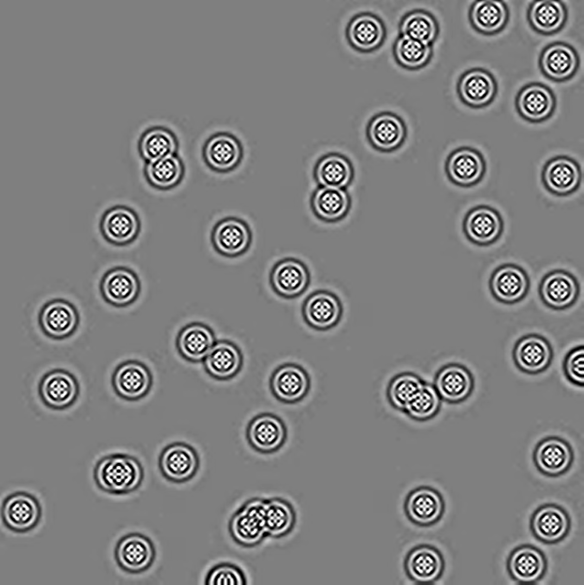

# 미분방정식과 코드 설계를 통한 2차원 파동 시뮬레이션 구현

> 작성 일자: 2022.07.13

> ⚠️ 이 문서를 읽기 전에 ⚠️
>
> 이 문서는 고등학교 재학 당시 개인 탐구 과제로 작성한 보고서의 내용을 그대로 옮겨 작성한 문서입니다.
>
> 학교 과제 등을 수행하는 과정에서 이 문서의 내용을 참고하는 것은 괜찮지만, 문서의 내용을 복사해서 그대로 이용하는 등의 행위는 삼가해 주시기 바랍니다.

## 탐구 동기 및 목적

「프로그래머를 위한 기초 해석학」에서는 다변수함수의 미분과 도함수를 설명하면서 편미분의 개념을 설명한다.
 편미분은 인공 신경망에 적용되는 역전파 기법 등에 활용되는데, 편미분을 통해 노드가 갖는 가중치가 신경망의 오차에 미치는 영향의 정도를 파악해 조절하며 오차를 최소화하게 된다. 이처럼 함수의 변화율은 어떤 변화하는 대상에 대해 그 함수의 변화를 예측하고 구조를 파악하는 데 이용되는데, 그 대표적인 예시가 바로 미분방정식이다.

 미분방정식은 다양한 학문에서 다양한 형태로 활용되는데, 컴퓨터과학에서는 주로 어떤 현상을 컴퓨터 상에서 시뮬레이션하는 데 활용된다. 그 예시로 라플라스 방정식을 들 수 있는데, 이 방정식은 어떤 상태의 공간을 기술하는 데 이용되는 방정식으로, 열과 흐름, 파동 등을 기술한다. 그 예시로는 전자기학과 천문학에서 전위 및 중력 퍼텐셜을 기술하는 데 활용됨을 들 수 있다.

 본 탐구에서는 미분방정식을 활용한 시뮬레이션을 파이썬으로 구현하고, 그 결과를 분석하면서 미분방정식을 어떤 형태로 시뮬레이션에 적용할 수 있는지, 시뮬레이션이 더 적합하도록 개선할 수는 없는지 등을 탐구하고자 한다. 또한, 탐구 내용을 바탕으로 Blender 등의 소프트웨어에서 3차원 유체 그래픽을 구현하면서 컴퓨터 그래픽과 모델링에 대해 이해하고 활용하는 것을 목적으로 한다.

## 이론적 배경

1. 미분방정식

미분방정식은 일반적인 방정식에서의 변수처럼 어떤 함수와 그 함수의 도함수로 구성된 형태의 방정식이다. 이때 ‘어떤 함수’가 하나의 변수로만 이루어져 있는 함수라면 그 방정식을 상미분방정식이라 하고, ‘어떤 함수’가 다변수함수이고 각 변수에 대한 편미분항이 포함되어 있다면 편미분방정식이 된다.

본 탐구에서 이용하는 미분방정식은 라플라스 방정식이다. 라플라스 방정식은 다음과 같은 수식으로 나타낼 수 있다.

$$\nabla^{2}f=0$$

이때 연산자 $\nabla^{2}$는 라플라스 연산자(Laplace operator)로, 3차원 직교 좌표계에서는 다음과 같이 나타낼 수 있다.

$$\nabla^{2}=\frac{\partial^{2}}{\partial x^{2}} + \frac{\partial^{2}}{\partial y^{2}} + \frac{\partial^{2}}{\partial z^{2}}$$

즉, 이 방정식은 어떤 함수 $f(x, y, z)$를 각 변수에 대해 2번 미분한 값의 합이 0인 해를 나타낸다.

본 탐구에서 구현할 라플라스 방정식을 활용한 2차원 시뮬레이션에서는 라플라스 방정식을 2차원 좌표계 상에서 근사할 것이다. 2차원 상에서 좌표 에 위치한 점의 값을 라 하면, 주변 9개의 점을 다음과 같이 나타낼 수 있다.

<p align="center">
    
    <div align="center" style="font-style: italic;"> 위 이미지에서 왼쪽 아래 점의 첨자는 오류로, {i-1, j+1}이 정확한 첨자이다.</div>
</p>

이때, 두 점 $(i, j)$와  $(i, j+1)$사이 거리 $\Delta x$에 대해, 다음의 근사가 성립한다.

$$\frac{\partial U}{\partial x} \simeq \frac{U_{i, j+1} - U_{i, j}}{\Delta x}$$

이는 점 $(i, j+\frac{1}{2})$에서의 기울기에 해당한다.

또한, 점 에서의 2차 미분계수 역시 마찬가지로 나타낼 수 있다.

$$\frac{\partial^{2} U}{\partial x^{2}} \simeq \frac{\frac{\partial  U}{\partial  x} \vert_{(i,j+\frac{1} {2})} - \frac{\partial  U}{\partial  x} \vert_{(i,j-\frac{1}{2})}}{\Delta x}$$

위 식에 $\frac{\partial U}{\partial x}$의 근삿값을 대입하면 다음으로 변형할 수 있다.

$$\begin{align}
\frac{\partial^{2} U}{\partial x^{2}} &\simeq \frac{\frac{U_{i, j+1} - U_{i, j}}{\Delta x} - \frac{U_{i, j} - U_{i, j-1}}{\Delta x}}{\Delta x} \nonumber\\
&= \frac{U_{i, j+1} + U_{i, j-1} - 2{U_{i, j}}}{(\Delta x)^{2}} \nonumber
\end{align}$$

이를 $y$에 대해서도 나타낼 수 있으며, 2차원 상의 점의 간격은 동일하다. 즉, $\Delta x = \Delta y$이다.

따라서, 좌표 $(i, j)$에 해당하는 값의 라플라스 연산 근삿값은 다음과 같다.

$$\begin{align}
\nabla^{2}U &= \frac{\partial^{2} U}{\partial x^{2}} \nonumber\\
&\simeq \frac{U_{i, j+1} + U_{i, j-1} + U_{i+1, j} + U_{i-1, j} - 4{U_{i, j}}}{(\Delta x)^{2}} \nonumber\\
\end{align}$$

이때 2차원 시뮬레이션 상의 점 간격 $\Delta x = 1$로 놓으면 위 식에서의 분자만 남게 된다. 따라서, 이 식을 다음과 같이 두 행렬의 곱으로 나타낼 수 있다.

$$\nabla^{2}U_{i, j} = \left [
\begin{matrix}
U_{i-1, j-1} & U_{i-1, j} & U_{i-1, j+1} \\
U_{i, j-1} & U_{i, j} & U_{i, j+1} \\
U_{i+1, j-1} & U_{i+1, j} & U_{i+1, j+1} \\
\end{matrix}
\right ]
\left [
\begin{matrix}
0 & 1 & 0 \\
1 & -4 & 1 \\
0 & 1 & 0 \\
\end{matrix}
\right ] $$

위 식에서 점 $(i, j)$와 주변 점을 나타낸 행렬에 곱해진 행렬을 **이산 라플라스 연산자**라 한다. 다만, 이러한 형태의 연산자는 값이 매끄럽게 변화하는 상황에서는 안정적이지만, 빠르게 변화하는 상황에서는 다음과 같이 대각선에 위치한 값을 추가적으로 고려하는 행렬이 더욱 안정적이다.

$$\left [
\begin{matrix}
\frac{1}{2} & 1 & \frac{1}{2} \\
1 & -6 & 1 \\
\frac{1}{2} & 1 & \frac{1}{2} \\
\end{matrix}
\right ] $$

따라서, 본 탐구에서는 위와 같은 형태의 행렬을 이용해 2차원 시뮬레이션을 구현할 것이다.

## 탐구 내용 및 과정

본 탐구에서는 이산 라플라스 연산자를 이용해 파이썬으로 2차원 시뮬레이션을 설계하였다. 시뮬레이션하고자 하는 현상으로는 수면에 물방울이 떨어질 때 그 파동이 퍼져나가는 모습을 선정했다. 이때 시뮬레이션을 구현하기 위해서는 시간에 따른 변화를 계산해 이를 연속적으로 나타내야 하므로, 다음 관계식을 이용하였다.

$$U^{n+1} = U^{n} + dt \left ( \frac{\partial U}{\partial t} \right )^{n}$$

$$\left ( \frac{\partial U}{\partial t} \right )^{n+1} = \left ( \frac{\partial U}{\partial t} \right )^{n} + dt \left ( \nabla^{2}U - U \left ( \frac{\partial U}{\partial t} \right )^{n} \right )$$

여기서 $U^{n}$은 $n$의 시간이 흐른 후의 값을 의미하고, $dt$는 시간에 따른 변화 정도를 나타내는 상수이다.

위의 관계식을 이용해 Google Colab에서 파이썬 시뮬레이션 코드를 작성하였다. 다음은 시뮬레이션을 설계할 때 이용한 라이브러리이다. 배열을 다루기 위한 Numpy, 그래프 표현을 위한 matplotlib, 시뮬레이션을 영상으로 변환하기 위한 OpenCV 등을 이용하였다.

```py
import numpy as np
from matplotlib import pyplot as plt
from IPython import display
import cv2
from google.colab.patches import cv2_imshow
```

다음은 코드 설계를 위한 변수이다. `N`은 시뮬레이션을 진행할 2차원 정사각 배열의 한 변의 길이이고, `randomUnits` 변수는 시뮬레이션 초기 조건으로 빗방울이 떨어지는 수이다. `stepPDE` 변수는 위의 관계식을 이용해 시뮬레이션을 몇 번 연산할지를 나타내고, 연산한 결과는 `frames` 배열에 저장된 후 이미지로 변환되어 영상으로 처리한다.

```py
N = 200
randomUnits = 50
stepPDE = 1000
fig = plt.figure(figsize=[100, 100])
frames = []
```

다음 Numpy 배열은 각각 시뮬레이션을 수행하는 데 이용된다. `U` 배열은 의 시간이 흐르는 과정에서 각 시간마다의 연산 후 모습을 저장하는 배열이고, `Ut` 배열은 위의 관계식에서 $\frac{\partial U}{\partial t}$를 나타낸다. `tempU`와 `tempUt`는 각각 연산 결과를 임시로 저장한 후 그 값을 다시 원래 `U`, `Ut` 배열로 복사하는 데 이용된다. 아래의 `init` 함수는 시뮬레이션 진행 후 다음 시뮬레이션을 위해 각 배열을 초기화하는 용도이다.

```py
U = np.zeros([N, N], dtype=np.float32)
Ut = np.zeros([N, N], dtype=np.float32) # du/dt
tempU = np.zeros([N, N], dtype=np.float32)
tempUt = np.zeros([N, N], dtype=np.float32)

def init(): # 배열 초기화 함수
    for i in range(N):
        for j in range(N):
            U[i][j] = np.float32(0)
            Ut[i][j] = np.float32(0)
```

다음 코드에서 위의 `for`문은 `N` by `N` 배열에서 `randomUnits` 값의 수만큼 임의의 좌표를 선정해서 그 위치의 값을 1로 설정하는데, 이는 초기 조건으로 물방울이 떨어지는 위치를 설정하는 것이다. 그 다음 코드 블록은 설정된 초기 조건을 이미지로 변환할 수 있도록 처리한 후 `frames` 배열에 저장한다. 그 아래 선언된 변수는 각각 위의 관계식에서 설정한 시간에 따른 변화 상수와, 물결이 퍼져나가며 감쇠하는 정도를 결정하는 상수이다.

```py
for i in range(randomUnits):
    a, b = np.random.randint(0, N, 2)
    U[a][b] = 1.0

a0 = -0.1; a1 = 0.1
a = (U - a0)/float(a1 - a0)*255
a = np.uint8(np.clip(a, 0, 255))
frames.append(a)

dt = np.float32(0.03) # 시간 변화
dmp = np.float32(0.005) # 물결 감쇠 정도
```

다음 함수는 점 $(i, j)$에 위치한 값에 대해 라플라스 연산한 값을 반환하는 함수이다. 위에서는 이를 두 행렬의 곱으로 나타냈으나, 구현의 편의를 위해 식으로 전개해 함수를 구현하였다.

또한, 함수에서 각 배열에 접근할 때 이용된 `min`, `max` 함수는 배열의 요소에 접근하는 과정에서 `IndexError`가 발생하지 않도록 방지하는 역할이다.

```py
def getLaplacian(a, i, j):
    return np.float32(0.5 * a[min(i+1, N-1)][min(j+1, N-1)]
                    + 0.5 * a[max(i-1, 0)][min(j+1, N-1)]
                    + 0.5 * a[min(i+1, N-1)][max(j-1, 0)]
                    + 0.5 * a[max(i-1, 0)][max(j-1, 0)]
                    + 1.0 * a[min(i+1, N-1)][j] 
                    + 1.0 * a[max(i-1, 0)][j]
                    + 1.0 * a[i][min(j+1, N-1)]
                    + 1.0 * a[i][max(j-1, 0)]
                    - 6.0  *a[i][j]
                    )
```

다음 함수는 위의 관계식을 이용해 1의 시간이 지난 후, 즉 한 단계가 진행된 후의 상태를 `U`와 `Ut`에 저장하는 함수이다. 시뮬레이션이 1단계 진행될 때마다 위 함수가 호출되어 배열이 업데이트된다.

```py
def solvePDE():
    global N
    for i in range(N):
        for j in range(N):
            tempU[i][j] = U[i][j] + dt * Ut[i][j]
            tempUt[i][j] = Ut[i][j] + dt * getLaplacian(U, i, j) - dmp * Ut[i][j]
    for i in range(N):
        for j in range(N):
            U[i][j] = tempU[i][j]
            Ut[i][j] = tempUt[i][j]
```

다음 `for`문은 `stepPDE` 값의 횟수만큼 시뮬레이션을 수행한다. 이때 함수를 호출한 후 `U` 배열을 이미지로 변환할 수 있도록 처리한 후 `frames` 배열에 추가한다. 또한, 시뮬레이션이 10단계 진행되었을 때마다 진행 상황을 출력한다.

```py
for i in range(stepPDE):
    if((i+1) % 10 == 0): print('%d steps done' % (i+1))
    solvePDE()
    a0 = -0.1; a1 = 0.1
    a = (U - a0)/float(a1 - a0)*255
    a = np.uint8(np.clip(a, 0, 255))
    frames.append(a)
```

다음과 같이 시뮬레이션을 1000단계 수행하는 데 약 7분이 소요되었다.

<p align="center">
    
</p>

다음은 처리한 시뮬레이션의 각 단계를 영상으로 변환하기 위한 변수이다. 영상의 fps는 초당 24프레임으로 설정했고, 크기는 배열의 크기와 같은 `N` by `N`으로, 파일명과 확장자는 `animate.mp4`로 설정했다.

```py
fps = 24; size = (N, N); output = './animate.mp4'
out = cv2.VideoWriter(output, cv2.VideoWriter_fourcc(*'mp4v'), fps, size, False)
```

마지막 단계로, `solvePDE` 함수를 수행하며 얻은 각 단계의 배열 모습을 저장한 배열을 순회하며 영상으로 변환해 파일을 내보낸다.

```py
for i in range(len(frames)):
    out.write(frames[i])
out.release()
```

## 탐구 결과 및 고찰

<p align="center">
    
    
    
    
</p>
<p align="center">
    시뮬레이션 실행 결과 생성된 영상 이미지
</p>

위 코드를 실행하여 얻은 결과는 다음과 같다. 처음 장면에 표시된 점을 기준으로 파동이 원형으로 퍼져나가는 과정을 시간에 따라 관찰할 수 있다. 위에 표시된 시뮬레이션 장면은 상수 `dt`와 `dmp`를 각각 0.03과 0.005로 설정해 진행한 것으로, 이를 변경할 경우 파동이 유지되는 시간과 퍼져나가는 속도가 달라진다.

위의 시뮬레이션 장면을 자세히 보면 시뮬레이션 시작 시 초기 상태가 지정된 점을 중심으로 파동이 퍼져나가는데, 그 중심부에서는 파동이 다이아몬드 형태를 이루고 있음을 알 수 있다. 이는 2차원 상에서 배열을 이용해 근사적으로 연산했기 때문으로, 연속된 두 점을 각각 배열 상에서 연속한 점으로 구현되어 형성된 파동의 파장이 점의 간격에 비해 작기 때문에 발생하는 한계점이다. 시뮬레이션을 구현할 때 이용한 이산 라플라스 연산자는 대각선의 위치를 고려한 행렬임에도 이러한 현상이 발생했으며, 주위 4개 점의 값만 고려하는 연산자를 이용할 경우 형성되는 다이아몬드 형태가 여러 겹으로 크게 유지된다. 이러한 현상을 해결하는 방법으로는 형성되는 파동의 파장을 배열의 칸 간격에 비해 더 크게 구현하거나, 주변의 더 멀리 떨어져 있는 점들의 값을 고려하는 새로운 이산 라플라스 연산자를 구현해 이용하는 방법 등이 있다.

컴퓨터 시뮬레이션에서 발생하는 이러한 오차는 어떤 현상을 컴퓨터 상에서 구현할 때 필연적으로 수행되는 근사 및 연산 과정에서의 실수 오차 등으로 인해 발생한다. 그 예시로 유체의 운동을 기술하는 나비에-스토크스 방정식을 활용한 유체 그래픽을 들 수 있는데, 나비에-스토크스 방정식은 아직 일반적인 해의 존재 여부가 확인되지 않은 미분방정식으로, 이를 활용하기 위해서는 컴퓨터를 통해 그 해를 근사적으로 얻는 수밖에 없다. 그러나 컴퓨터 그래픽 분야에서는 유체의 운동을 완벽히 구현하지 않아도 게임 및 영화 등에 충분히 활용될 수 있으므로 방정식의 근사해를 이용하는 방향으로 그래픽을 구현한다.

## 제언 및 소감

탐구를 진행하면서 미분방정식을 코드로 표현하는 방법을 고민하고, 이를 구현하면서 미분방정식이 컴퓨터 시뮬레이션에서 활용되는 과정을 직접 체험해볼 수 있었다. 코드를 구현한 후 실행 결과를 분석하면서 시뮬레이션의 한계점인 파원 주변의 파동이 다이아몬드 형태로 나타나는 것을 확인하면서 아쉬운 마음이 남았으나, 이는 컴퓨터 시뮬레이션 과정에서 발생하는 필연적 오차로, 이를 최대한 감소시키는 여러 방법을 고민하며 실제 컴퓨터 그래픽 및 렌더링에서 이러한 시뮬레이션 결과가 활용되는 방향을 이해하게 되었다.

후속 탐구로는 유체의 운동을 기술하는 미분방정식인 나비에-스토크스 방정식을 이용해 유체 운동 시뮬레이션을 구현하고, Blender 등 3차원 그래픽 소프트웨어 내부에서 이를 구현하고 처리하는 알고리즘과 비교하여 개선점 및 적용 가능성 등에 대해 확인할 것이다.